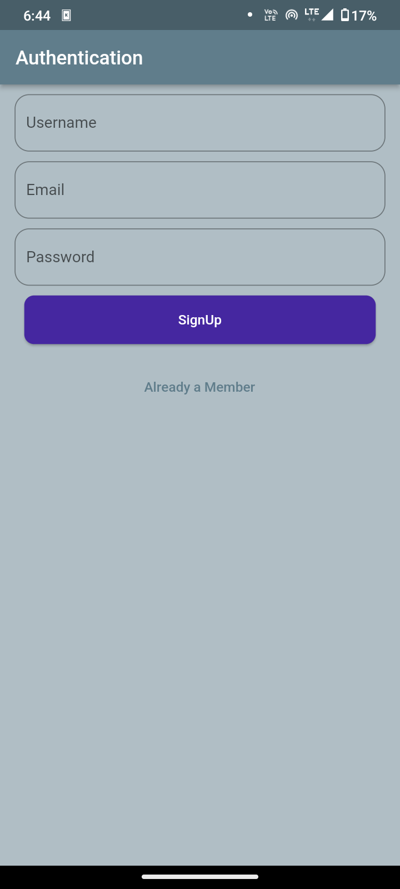
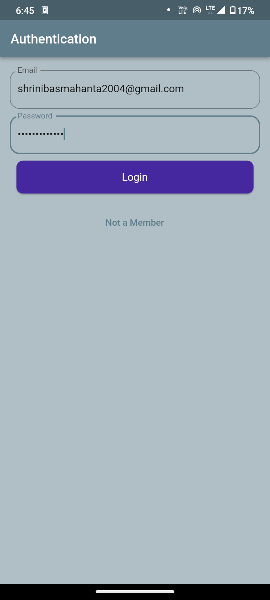
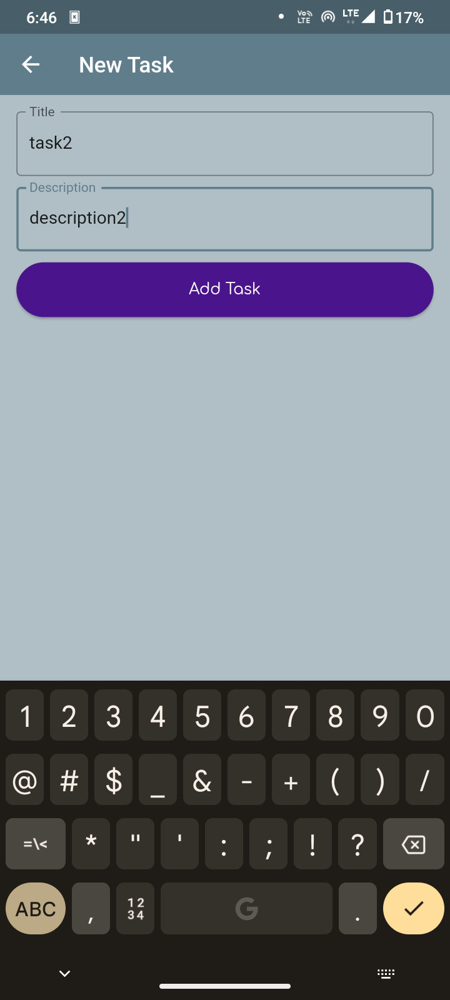
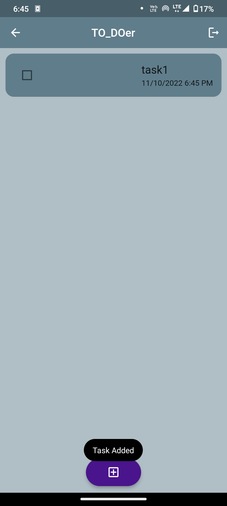

<h1>

 TO_DOer

<h1>

<h2>
Android (ToDo app) Application made with flutter. 
</h2>  

<h1 align = center>Tech Stack(Technologies used):</h1>  

 ### -Dart Programming Language.
 
 ### -Flutter SDK
 
 ### -Firebase(BaaS)

<h1 align = center>Screenshots:</h1> 

<h1 align = center>

</h1>

<h1 align = center>

</h1>

<h1 align = center>Data Flow:</h1> 
<h1 align = center>

</h1>

---
## AuthPage

### -On starting the application a signup page is shown where you can create your account.
### -If you are alreaady having an account then you can directly use the login page.
### -Once you are logged in there will be no need to login again unless you logout.
---
## Functionality:-

### -The homepage displays all the tasks in a list view.

### -The "+" button lets you add new tasks .

### -On the new task page you can specify a title and description for your task.

### -On adding a Task the task data is stored in cloud using firebase(baas).

### -The homepage syncronises itself after the task is added or deleted.

### -To delete a task slide the task and press on the delete button. 
---
<h1 align = center>Credits:-</h1> 

## Mentor:
 #### Joydev DasMohapatro Sir

## Created By:
#### Shrinibas Mahanta 

## Special Thanks to:
 #### -Prachurya Jena.
 #### -Sagnik Behera.
 #### -Puneet Sahoo.
 #### -Piyush Tripathy.

<h1 align = center>To checkout My github Repository:</h1> 

<h2 align = center>visit: <a href = "https://github.com/2k4sm/TO_DOer">github.com/2k4sm/TO_DOer</a></h2> 

<h1 align = center>To Download The App:</h1> 

<h2 align = center>Scan The QR Code On Your Android:</h2> 

<h1 align = center></h1>

---

